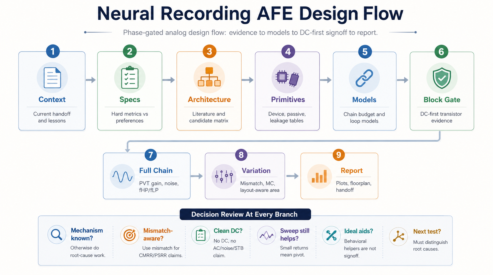
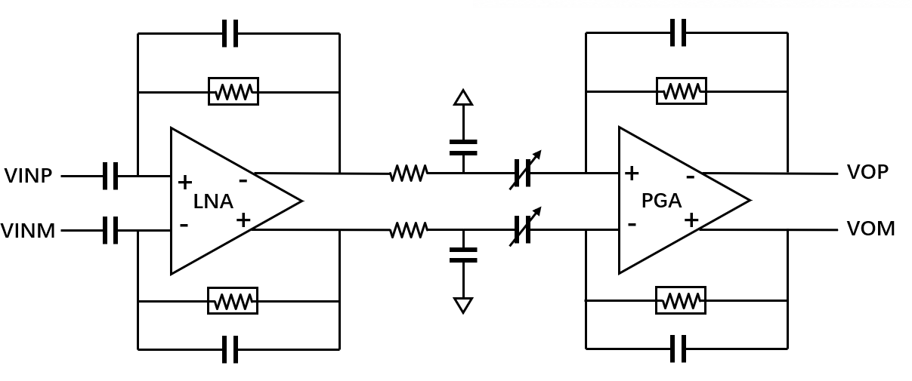
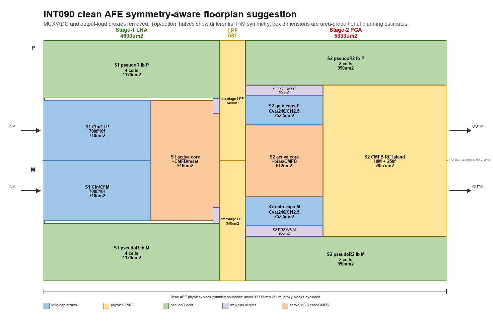

# Neural Recording AFE Design Flow

A Codex skill for running neural-recording analog front-end design as a
phase-gated, evidence-driven engineering workflow.

The skill guides an agent through specifications, literature comparison,
architecture selection, primitive characterization, behavioral modeling,
transistor-level implementation, Spectre verification, module reports,
full-chain plots, layout/floorplan planning, and tapeout-oriented checks.



## Why This Exists

Long analog design conversations are easy to derail: an agent may continue the
latest branch instead of the right branch, optimize a metric before identifying
the mechanism, or promote a schematic-only result that is difficult to lay out.

This skill encodes a stricter workflow:

- Define hard specs before sizing circuits.
- Compare architectures before committing to a transistor path.
- Characterize PDK primitives before broad sweeps.
- Build behavioral models before expensive full-chain iteration.
- Run DC-first module gates and save module reports/images.
- Use mismatch-aware CMRR/PSRR evidence.
- Treat pseudo-resistor and well-bias connectivity as signoff items.
- Apply tapeout-oriented constraints before calling a design final.

## Repository Layout

```text
.
|-- README.md
|-- USAGE.md
|-- .gitignore
`-- skills/
    `-- afe-analog-design-flow/
        |-- SKILL.md
        |-- agents/
        |-- assets/
        |-- references/
        `-- scripts/
```

The installable Codex skill is:

```text
skills/afe-analog-design-flow
```

## Example Architecture

The included example figures come from an INT090-style two-stage neural AFE:
capacitive-feedback LNA, interstage LPF, PGA/VGA-style second stage,
pseudo-resistor feedback, and local well-bias handling.



The repository also includes a physical-block layout suggestion figure. It is
not final layout; it is a planning artifact for symmetry, signal flow,
common-mode islands, pseudo-resistor locality, and area-accounting review.



## Included Helper Scripts

- `find_latest_handoff.py`: locate likely current AFE handoff files.
- `extract_metrics.py`: extract compact metrics from candidate CSVs.
- `make_four_plot_panel.py`: stitch gain/noise/CMRR/PSRR plots into one panel.
- `candidate_report_check.py`: check whether a candidate directory has expected
  evidence artifacts.
- `pseudor_connectivity_audit.py`: extract pseudoR-like netlist node mappings
  for PSUB/DNW/PWELL/A/B review.

## What Is Not Included

This public repository intentionally does not include:

- Foundry PDKs, model files, or private model sections.
- Raw PEX netlists or simulator databases.
- Private paper PDFs.
- Project-specific Spectre raw output.
- Local handoff files from private design threads.

## Contact

Maintainer: HC Wang  
Email: [hcwang@hdu.edu.cn](mailto:hcwang@hdu.edu.cn)

## License

This project is released under the [MIT License](LICENSE).
